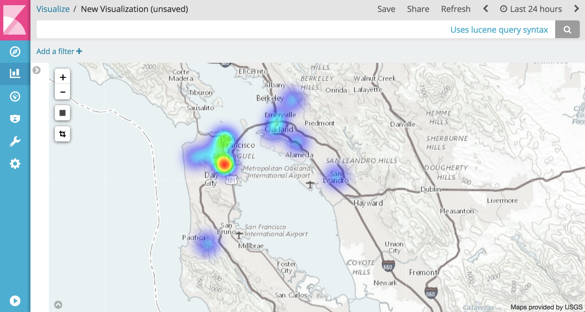

[](https://circleci.com/gh/Nextdoor/bender)


This project provides an extendable Java framework for creating serverless ETL
functions on [AWS Lambda](https://aws.amazon.com/lambda/). Bender handles
the complex plumbing and provides the interfaces necessary to build modules for
all aspects of the ETL process.

An example of what you can do is enrich your log data by appending GeoIP information. For example:

```
input: {"ip": "8.8.8.8"}
output: {"ip": "8.8.8.8", "geo_ip": {"location": {"lat": 37.751, "lon": -97.822}}}
```

This enables you to create dashboards like these in [Kibana](https://www.elastic.co/guide/en/elasticsearch/reference/5.4/geo-point.html):


### Configuration

Bender is easily configurable with either json or yaml. The
[configuration guide](http://oss.nextdoor.com/bender) provides documentation
for option specifics and [sample_configs/](sample_configs/) contains real world
examples of how Bender is configured with commonly used pipelines.

### Initial Support

While developers are able to write their own Input Handlers, Deserializers,
Operations, Wrappers, Serializers, Transporters, or Reporters, out of box the
Bender contains basic functionality to read, filter, manipulate, and write JSON
from [Amazon Kinesis Streams](https://aws.amazon.com/kinesis/streams/) or
[Amazon S3](https://aws.amazon.com/s3/) files. Specially the following is
supported:

##### Handlers
Handlers interface between Amazon Lambda
[triggers](http://docs.aws.amazon.com/lambda/latest/dg/invoking-lambda-function.html)
and data sources provided to your ETL function. Events or lines are able to
read from:

* Kinesis
* S3
* S3 via SNS

##### Pre Deserialization Filters
Modular filter support is not yet included but basic string matching and regex
based filters are included as a part of Bender Core.

##### Deserializers
Included is a generic JSON deserializer to transform strings into GSON objects.
This allows processing of loosely defined schemas such as those done in
application logging. For schema validation the use of GSON to POJOs is
encouraged.

##### Operations
Data sometimes needs to be transformed, fixed, sanitized, or enriched.
Operations allow for these types of data manipulation.

* Geo IP lookup
* JSON Root node promoter (in the case you have nested data)
* JSON Array Dropping
* JSON Array Splitting (turning a single event into multiple)
* Appending value type information to key names (helps with writing data to
  ElasticSearch)

##### Wrappers
Optionally wrap data to provide additional information on where the data
originated from and what processed it:

* Kinesis Wrapper
* S3 Wrapper
* Basic Wrapper

##### Serializers
Write your transformed and wrapped data back into JSON before loading it
elsewhere.

##### Transporters
Transporters convert string payloads to serialized wire formats and send
batches of data to destinations.

* Firehose
* S3 (partitioning support included)
* Elasticsearch (time based index inserts)
* Splunk
* Scalyr
* Sumo Logic
* Datadog

##### Reporters
Monitor the ETL process at each phase within your function and output those
metrics for easy consumption in

* Cloudwatch Metrics
* Datadog

## Local Development/Testing
When you are developing your configuration (or a new transport), you may want
to test the configuration with some local data. This can be done with the CLI
tool.

The Bender CLI tool operates almost entirely as if it were in Lambda. It mocks
out the appropriate source of the event (Kinesis, S3, etc) and passes the data
in to the Handler exactly the way Lambda would.

_(Note, this only supports the KinesisHandler at the moment)_.

### Command Line Arguments

```bash
$ java -jar bender-cli-1.0.0-SNAPSHOT.jar
2018-03-30 11:06:27,482 ERROR - Missing required option: s
usage: BENDER_CONFIG=file://config.yaml java bender-cli-1.0.0-SNAPSHOT.jar
 -H,--help                        Print this message
 -h,--handler <arg>               Which Event Handler do you want to simulate?
                                  Your options are: KinesisHandler.
                                  Default: KinesisHandler
    --kinesis_stream_name <arg>   What stream name should we mimic? Default: log-stream (Kinesis
                                  Handler Only)
 -s,--source_file <arg>           Reference to the file that you want to process. Usage depends on
                                  the Handler you chose. If you chose KinesisHandler then this is a
                                  local file.
```

### Actual processing of data

You can use the Bender CLI tool to actually process data and push it to your
destination. This is not the ended production use of the tool, but for validation
of your configuration this can work very well.

Here is an example of processing some data, and outputting a simple local file
with the new data.

*`config.yaml`*
```yaml
handler:
  type: KinesisHandler
  fail_on_exception: true
  add_shardid_to_partitions: true
sources:
- name: Syslog Messages
  source_regex: arn:aws:kinesis:.*:.*:stream/.*
  deserializer:
    type: GenericJson
    nested_field_configs:
    - field: MESSAGE
      prefix_field: MESSAGE_PREFIX
  operations:
  - type: TimeOperation
    time_field: $.EPOCH
    time_field_type: SECONDS
  - type: JsonKeyNameOperation
  - type: JsonDropArraysOperation
wrapper:
  type: KinesisWrapper
serializer:
  type: Json
transport:
  type: File
  filename: output.json
```

*Execution*
```bash
$ BENDER_CONFIG=file://config.yaml java -jar bender-cli-1.0.0-SNAPSHOT.jar --source_file data.json
2018-03-30 11:26:24,278 INFO  - Invoking the Kinesis Handler...
2018-03-30 11:26:24,950 INFO  - Parsing local0.mini.json...
2018-03-30 11:26:25,011 INFO  - Processed 1000 records
2018-03-30 11:26:25,031 INFO  - Bender Initializing (config: file://config.yaml)
2018-03-30 11:26:25,040 DEBUG - Generating BenderConfig object... this can take a little bit
2018-03-30 11:26:30,447 INFO  - Using source: Syslog Messages[sourceRegex=arn:aws:kinesis:.*:.*:stream/.*, containsStrings=[], regexPatterns=[]], deserializers=[GenericJsonDeserializer]], operations=[TimeOperation, KeyNameOperation, DropArraysOperation]]
```

*Output*
Here's the output of the file.. just the first line:
```bash
$ head -1 output.json
{"partition_key":"1","sequence_number":"744","source_arn":"arn:aws:kinesis:us-east-1:123456789:stream/log-stream","function_name":"cli-main","processing_t  ime":1522434390690,"arrival_time":1522434384946,"processing_delay":67731599,"timestamp":1522366659091,"payload":{"program__str":"app","host__str":"myhost.com","facility__str":"local0","priority__str":"info","message":{"type__str":"image","action__str":"pull","time__long":1522366659,"id__str":"image:id","actor":{"id__str":"image:id","attributes":{"name__str":"image"}},"timenano__long":1522366659090067620,"status__str":"pull"},"message_prefix__str":"Some prefix ... "  ,"epoch__str":"1522366659.091506"}}
```

Here is the output in a slightly more readable format:
```json
{
  "partition_key": "1",
  "sequence_number": "744",
  "source_arn": "arn:aws:kinesis:us-east-1:123456789:stream/log-stream",
  "function_name": "cli-main",
  "processing_t  ime": 1522434390690,
  "arrival_time": 1522434384946,
  "processing_delay": 67731599,
  "timestamp": 1522366659091,
  "payload": {
    "program__str": "app",
    "host__str": "myhost.com",
    "facility__str": "local0",
    "priority__str": "info",
    "message": {
      "type__str": "image",
      "action__str": "pull",
      "time__long": 1522366659,
      "id__str": "image:id",
      "actor": {
        "id__str": "image:id",
        "attributes": {
          "name__str": "image"
        }
      },
      "timenano__long": 1522366659090067700,
      "status__str": "pull"
    },
    "message_prefix__str": "Some prefix ... ",
    "epoch__str": "1522366659.091506"
  }
}
```

## Deployment

The easiest way to deploy your function is to use
[Apex](https://github.com/apex/apex). A sample project is included under
[example_project/](example_project/).
The project provides an example of a function that is triggered by Kinesis,
drops data matching a regex, and forwards the rest to Firehose.

Note to deploy the example you will need to create an IAM role to allow your
lambda function to read from kinesis and write to firehose. Your role will need
the following two policies:

`arn:aws:iam::aws:policy/service-role/AWSLambdaKinesisExecutionRole`
`arn:aws:iam::aws:policy/AmazonKinesisFirehoseFullAccess`

After creating your role edit `example_project/project.json` with the role ARN.
You will also need to create the source Kinesis and destination Firehose
streams.

To deploy:

    cd example_project/
    make deploy
    DRY=false make deploy


## Contributing
Features and bug fixes are welcome. Please adhere to the following guidelines:

- Use Google's Java [style guide](https://github.com/google/styleguide) for
  your IDE.
- Be conscientious of dependencies you add to Bender Core.
- Help maintain unit test code coverage by adding tests for each branch in new
  code.
